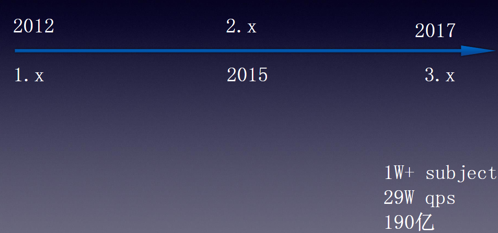
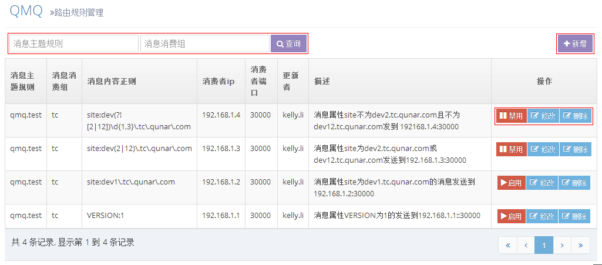
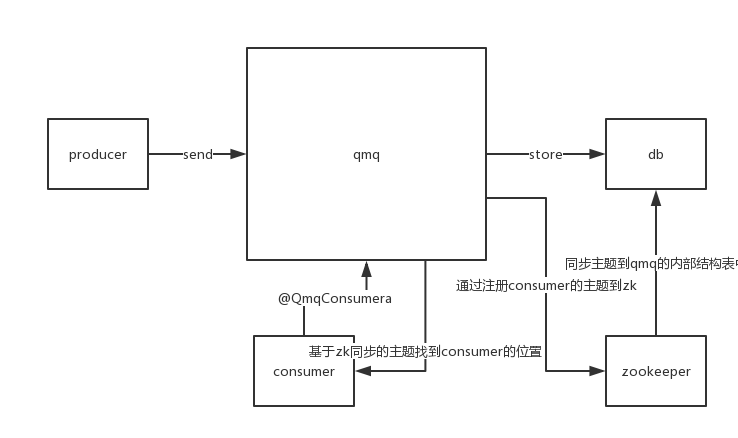
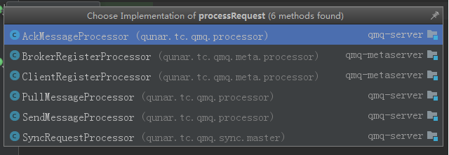
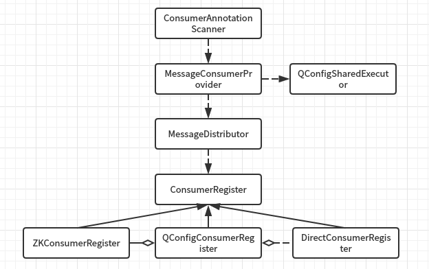

# Qunar Message Queue #

* QMQ
    * qmq的特点
    * qmq中间件模块
    * qmq版本更新
* Qmq 使用
    * qmq client producer应用
    * qmq client consumer应用
    * qmq admin 使用
         * 上线
         * 路由规则  
           
* Qmq部分源码分析
    * qmq producer
    * qmq consumer

   

## qmq
### qmq的特点
qmq（qunar message queue）是公司自主开发的高可靠消息系统。具有高可靠、高可用、高性能、支持事务
### qmq中间件模块
* qmq client 是一个jar包，提供Producer API用于发送消息，Consumer API用于接收消息
* qmq admin是消息管理后台，用户可登录系统，申请消息上线，查看我的消息内容和消费情况。遇到消息消费失败可以人工干预，手动重发消息。
* qmq server 负责接收client producer投递的消息，然后查找订阅该消息的client consumer，然后推送过去。server内部提供各种机制保证消息准确高效的送达
* qmq delay 负责接收client producer发送的延迟消息做delay操作，当到达消息的预定投递时间时，才发送给qmq server。
* qmq task 执行定时任务。如将client producer发送失败的消息重推给server，另一个功能是将历史消息扫出来，交给qmq backup备份
* qmq backup 向hbase中备份历史消息和写入消息发送日志，并提供查询历史消息和消息发送日志的接口给其他模块调用


### qmq版本更新
#### 2.0及以上的优点
* 升级到2.x以上并且采用2.x的配置方式就不再关心发送和消费消息的机房了
* 升级到2.x及以上将享受更高的可靠性，当一个机房的qmq server发生故障的时候可以将消息路由到其他机房
* 升级到2.x及以上可以通过qconfig动态修改线程池等配置，无须重启应用
此外，qmq2.0及以上提供了一个不需要zk地址的构造函数，即无参构造函数。该无参构造函数会自动路由消息的zk地址，具体规则如下：

dev环境->devzk

beta环境->betazk

线上环境->自动识别发送消息所在机房对应的zk,如果是非可靠或者延迟消息，也会自动识别，并且所有的消息会自动分类



## Qmq 使用
* 消息分类
**按可靠性分类：**
1. 事务持久型消息生成者，（非事务）持久型消息生产者，非持久型生产者和非可靠消息生产者
其中，事务持久型消息生产者：可靠性由qmq保证，非常可靠，可与业务绑定在一个事务中，业务处理成功消息发送，业务处理失败业务回滚消息不发送，但并发量不高
2. 持久型消息生产者：可靠性由qmq保证，非常可靠，业务处理和发消息不在一个事务中，可能会导致业务处理失败但消息发送出去了，但并发量不高
3. 非持久型消息生产者：消息在client端不持久化也不保证事务，在server端持久化，可靠性中等，client端可通过捕获异常和响应监听实现重发提高可靠性，并发量中等
4. 非可靠消息生产者：消息在client端和server端都不持久化，而且消息消费者消费失败也不会重推消息，可靠性最低，但是并发量大，性能高，一般用在非可靠通知场景。
**消息生产者按消息投递时间分为：**
及时消息生产者和延迟（或定时）消息生产者

* 不同类型消息生产者发送消息的过程


### qmq client producer
#### producer的应用
* 1.环境配置

``` <properties> 
         <qmq.version>最新版本</qmq.version>
     </properties>
     <dependencies>
            <dependency>
                  <groupId>qunar.tc</groupId>
                  <artifactId>qmq-client</artifactId>
                  <version>${qmq.version}</version>
            </dependency>
     </dependencies> 
   ```
* 2.创建 qmq producer数据库（发送持久型消息需要创建qmq produce数据库，只发送非持久型消息或非可靠消息则无需创建）
* 3.配置TransactionManager和MessageProducer

第一个配置适合:
* 持久实时消息
* 持久事务实时消息
* 持久延迟消息
* 持久事务延迟消息
    
第二个配置适合:
* 非持久及时消息
* 非持久延迟消息
* 非可靠消息

```
<!-- 如果是发持久消息，这样配置即可，无需再需要其他配置 -->
       <bean id="messageProducer" class="qunar.tc.qmq.producer.MessageProducerProvider" >
           <property name="transactionManager" ref="transactionManager" />
       </bean>
       <bean id="transactionManager" class="qunar.tc.qmq.producer.tx.TransactionManager">
           <constructor-arg name="dataSource" ref="prodDataSource" />
       </bean>  
       
       <!-- 如果是非持久消息，这样配置即可，无需再需要其他配置 -->
       <bean id="messageProducer" class="qunar.tc.qmq.producer.MessageProducerProvider" /> ` 
```

```    /**
        * 显示设置机房
        *
        * @param registryURL
        * @param group
        */
       public MessageProducerProvider(String registryURL, String group) {
           this(new DefaultRouterManagerDispatcher(new DubboRouterManager(new LocalConfigRouter(registryURL, group))));
       }
```
registryURL为qmq_server dubbo服务的注册中心地址,group为qmq_server dubbo服务的注册组名,现在已经不使用这种构造函数了，使用自动路由的方式
```     /**
         * 自动路由机房
         */
        public MessageProducerProvider() {
            this(new DefaultRouterManagerDispatcher(new DubboRouterManager(new QConfigRouter(INSTANCE))));
        }
```
自动路由机房：获取公共的zookeeper配置-->获取qconfig中配置的所有注册的dubbo服务的group对应zookeeper机房的信息-->判断所属机房dev和beta都是cn6，prod根据hostname进行判断-->筛选提供broker的dubbo服务的group对应机房
* 4.使用MessageProducer生成消息、发送消息

```
@Resource
    private MessageProducerProvider messageProducerProvider;
    @Value("${qmq.fetch.subject}")
    private String fetchSubject;  
    public boolean sendMessage(String date){
            Message message = messageProducerProvider.generateMessage(fetchSubject, 1, TimeUnit.HOURS);
            message.setProperty("date",date);
            messageProducerProvider.sendMessage(message);
            return true;
    }
```
消息生成方法
```
//生成一条消息，消息id由系统生成，过期时间为默认的15分钟
Message generateMessage(String subject);
 
//生成一条消息，消息id由系统生成，过期时间由用户指定，过期时间是相对于消息第一次投递时间的偏移量，15分钟至24小时有效
Message generateMessage(String subject, long expire, TimeUnit timeUnit);
 
//生成一条消息，消息id由用户指定，过期时间为默认15分钟
Message generateMessage(String messageId, String subject);
 
//生成一条消息，消息id由用户指定，过期时间由用户指定，过期时间是相对于消息第一次投递时间的偏移量，15分钟至24小时有效
Message generateMessage(String messageId, String subject, long expire, TimeUnit timeUnit);
```
消息属性设置API
```
//设置延迟消息属性
//设置消息计划在未来的投递时间，时间为绝对值
void setDelayTime(Date date);
//设置消息延迟投递时间，延迟投递时间为相对于消息创建时间的偏移量
void setDelayTime( long delayTime, TimeUnit timeUnit);
//设置是否手动ack
/**
 * 期望显式的手动ack时，使用该方法关闭qmq默认的自动ack。
 * 该方法必须是在consumer端的MessageListener的onMessage方法入口处调用，否则会抛出异常
 * <p/>
 * 在producer端调用时会抛出UnsupportedOperationException异常
 *
 * @param auto
 */
void autoAck(boolean auto);

//设置非可靠消息属性
void setReliabilityLevel(ReliabilityLevel level);
 
//设置业务属性
void setProperty(String name, boolean value);
void setProperty(String name, int value);
void setProperty(String name, long value);
void setProperty(String name, float value);
void setProperty(String name, double value);
void setProperty(String name, Date date);
void setProperty(String name, String value);
```
发消息可以设置消息发送状态的监听器，注册监听之后可以知道消息是否成功发送给了Broker，但无法知道是否发送给了Consumer

```
void sendMessage(Message message);
void sendMessage(Message message, MessageSendStateListener listener);

public void sendMessage(Message message) {
    sendMessage(message, globalListener);
}
```
在resources下放置qmq-producer.properties文件，可配置发送消息系统参数，合理的配置能提高发送性能，以下配置都是系统默认值，请根据各自业务需求调节
```
#发送队列大小
queue.mem.size=10000
#发送队列出队线程数
queue.send.threads=2
#发送队列批量出队消息个数
queue.send.batch=20
#发送到broker失败后重试次数
queue.send.try=2
#是否同步发送（只对非持久消息和非可靠消息有效）
queue.send.sync=false
#发送消息状态监听器线程池守护线程数
listener.threas=10
#发送消息状态监听器线程池队列大小
listener.queueSize=1000
```

### qmq client consumer
#### consumer的应用
* 1.环境配置
* 2.配置MessageConsumer
```
<beans xmlns:xsi="http://www.w3.org/2001/XMLSchema-instance"
       xmlns:context="http://www.springframework.org/schema/context"
       xmlns:qmq="http://www.qunar.com/schema/qmq"
       xmlns="http://www.springframework.org/schema/beans"
       xsi:schemaLocation="http://www.springframework.org/schema/beans
       http://www.springframework.org/schema/beans/spring-beans.xsd
       http://www.qunar.com/schema/qmq
       http://www.qunar.com/schema/qmq/qmq.xsd
       http://www.springframework.org/schema/context
       http://www.springframework.org/schema/context/spring-context.xsd">
 
    <!-- 配置扫描哪些包 -->
    <context:component-scan base-package="com.qunar.flight.jy.prism.*.qmq"/>
    <qmq:consumer/>
</beans>
```
* 3.订阅消息，处理消息
```
@QmqConsumer(prefix = "${flight.jy.refund.prefix}", consumerGroup = "flight.jy.refund.group")
public void onMessage(Message message) {
    QMonitor.recordOne("receive_message_counts");
    String date = message.getStringProperty("date");
//...
}
```
### qmq admin使用
qmq admin 地址：http://dev.qmq.corp.qunar.com/message.do
#### 消息查询

#### 上线申请
> * consumer使用了qmq client 版本大于等于 1.3.6不需要做上线申请，小于1.3.6必须做上线申请(目前已经不需要了)
> * consumer加减机器不需要做上线申请
> * producer发非持久消息使用了qmq client 版本大于等于1.3.6不需要做上线申请，小于1.3.6必须做上线申请（也已经不需要了）
> * producer发非持久消息加减机器不需要做上线申请
> * producer发持久消息必须做上线申请 qmq client 版本大于等于1.3.6申请的subject都对应一个业务库只需要申请一次，选其中一个subject填就行。 版本小于1.3.6所有subject都需要申请一次
> * producer发持久消息加减机器必须重新做上线申请，填写新增机器

#### 路由规则

qmq默认会给同一个消费者组下的某一台机器发消息，这台机器随机选择。但是在dev或beta环境，可能会根据业务需要通过消息内容的某个属性特征将消息发到消费组的某一台固定的机器。


例子

| 消息主体规则  | 消息消费组    | 消息内容正则  | 消费者ip   | 消费者端口 |
| ------------- |:-------------:| :------------:| :---------:| :--------: |
| qmq.test      | tc            | VERSION:1     | 192.168.1.1| 30000      |

qmq.test.a这条消息中有一个VERSION属性，它的值为1时，只发给192.168.1.1:30000，配置如下
通过路由规则可以让消息发到指定的机器，适用于dev和beta环境做消息分发调试选择路由规则菜单 可查看所有的路由规则


## qmq部分源码分析
### qmq producer



1) qmq启动：
初始化MessageStore-->注册消息发送，消息拉取，消息ack的处理器-->注册listener，监听consumer注册节点
```
    public void contextInitialized(ServletContextEvent sce) {
        wrapper = new ServerWrapper();
        wrapper.start();
    }
```

2) qmq client发送消息
MessageProducerProvider在send消息后，先判断是否重复入队，决定是否丢弃；继而判断是否指定store，决定同步发送
消息队列发送
按组切分消息队列后按照路由分组发送

```
ProduceMessageImpl pm = initProduceMessage(message, listener);
produce.send->
    if (state.compareAndSet(INIT, QUEUED)) {
                tries.incrementAndGet();
                if (store == null && syncSend) {
                    sender.send(this);
                    base.addTimeAnnotation("sync enter queue");
                } else if (sender.offer(this)) {
                    base.addTimeAnnotation("async enter queue");
                    QmqLogger.log(getBase(), "进入发送队列.");
                } else if (store != null) {
                    base.addTimeAnnotation("enter queue failed, wait for task");
                    QmqLogger.log(getBase(), "内存发送队列已满! 此消息将暂时丢弃,等待task处理");
                } else {
                    if (ReliabilityLevel.isLow(getBase())) {
                        base.addTimeAnnotation("enter queue failed, throw");
                        QmqLogger.log(getBase(), "内存发送队列已满! 非可靠消息，此消息被丢弃.");
                        return;
                    }
                    QmqLogger.log(getBase(), "内存发送队列已满! 此消息在用户进程阻塞,等待队列激活.");
    
                    if (sender.offer(this, WAIT_ENQUEUE_TIMEOUT)) {
                        base.addTimeAnnotation("enter queue succ");
                        QmqLogger.log(getBase(), "重新入队时成功进入发送队列.");
                    } else {
                        base.addTimeAnnotation("enter queue failed");
                        QmqLogger.log(getBase(), "由于无法入队,发送失败！取消发送!");
                    }
                }
            } else
                throw new IllegalStateException("同一条消息不能被入队两次.");    
        }
PRCQueueSender.send->
groupBy(list)
group.send->
DubboConnection.send->
BrokerMessageService.send->
```
3) qmq 处理收到的消息,将消息推送到consumer
```
NettyServerHandler#channelRead0->
processMessageReceived(ChannelHandlerContext ctx, RemotingCommand cmd)
    if (cmd != null) {
                switch (cmd.getCommandType()) {
                    case REQUEST_COMMAND:
                        processRequestCommand(ctx, cmd);
                        break;
                    case RESPONSE_COMMAND:
                        processResponseCommand(ctx, cmd);
                        break;
                    default:
                        break;
                }
            }->
NettyRequestExecutor#execute->
SendMessageProcessor.processRequest  
RECEIVE_POOL.submit(new ReceiveTask(receiver, messages, context));

```




3) producer发送消息，就是调用qmq服务端dubbo接口，不会抛露dubbo接口

### qmq consumer



ConsumerAnnotationScanner类：用于扫描consumer注解
```                      
ConsumerAnnotationScanner#parseMethods

```

MessageConsumerProvider类：组织消费者各种参数，并创建用来处理消息的线程池QConfigSharedExecutor
```
    /**
     * 端口使用随机分配的，zk订阅所有集群的
     * <p/>
     * 只供<qmq:consumer />这种形式使用
     */
    public MessageConsumerProvider() {
        this.port = NetUtils.getAvailablePort();
        this.useRandomPort = true;
        this.executors = new QConfigSharedExecutor();
        RegistryResolver registryResolver = QConfigRegistryResolver.INSTANCE;
        this.me = IPUtil.getLocalHost(registryResolver.resolve());
        this.register = new QConfigConsumerRegister(me, registryResolver);
        log.warn("友情提示: 如果使用QMQ 2.0,并且使用广播的模式(addListener第二个参数为空),则你需要调用给MessageConsumerProvider设置端口号或者<qmq:consumer port=\"30000\" />");
    }
    
        public MessageConsumerProvider(String zkAddress, int servicePort) {
            Preconditions.checkArgument(servicePort > 0, "端口非法");
            Preconditions.checkArgument(!StringUtils.isEmpty(zkAddress), "zk 地址为空，请检查配置");
    
            this.me = IPUtil.getLocalHost(zkAddress);
            this.port = servicePort;
            this.register = new QConfigConsumerRegister(me, zkAddress);
            log.warn("友情提示: 你使用了QMQ 2.0，但没有使用2.0的配置方式，使用QMQ 2.0将获得更好的可靠性支持，在多个机房任意漂移，并且配置更简单，参考: http://wiki.corp.qunar.com/pages/viewpage.action?pageId=64114065");
        }

```

QConfigSharedExecutor线程池中，使用了qconfig去配置线程池的参数
```
executorManager = new ThreadPoolExecutorManager("qmq-msg-handler-");//threadPoolNamePrefix
```

MessageDistributor类用于处理消息，同时也生成消费者的listener


其中的一个细节可以看到广播模式的实现原理，实际上就是当group为空的时候，将group换成了消费者的ip+port，从而使每个消费者都有一个单独的group
```
private String getRealGroup(String consumerGroup) {
        if (Strings.isNullOrEmpty(consumerGroup)) return myAddress;
        return consumerGroup;
    }
```
另外当consumer端listener处理完message后需要向qmq server端返回一个ack(一个dubbo调用),告诉server端这个group的consumer成功消费了这条消息.qmq默认是同步ack,并且qmq client封装了同步ack的代码如果你使用了异步ack,即qunar.tc.qmq.Message#autoAck(false),那么需要你在qunar.tc.qmq.MessageListener#onMessage中显示的调用Message#ack来向qmq server ack


