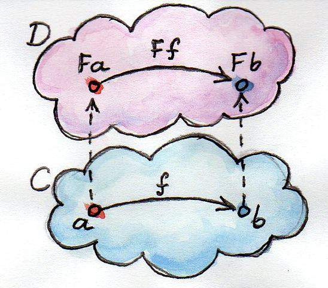

_REF: http://www.ruanyifeng.com/blog/2017/02/fp-tutorial.html_

## Functional programming
* 与面向对象编程（Object-oriented programming）和过程式编程（Procedural programming）并列的编程范式。
* 最主要的特征是，函数是第一等公民。
* 强调将计算过程分解成可复用的函数，典型例子就是map方法和reduce方法组合而成 MapReduce 算法。
* 只有纯的、没有副作用的函数，才是合格的函数。

### 范畴论
函数式编程的起源，是一门叫做范畴论（Category Theory）的数学分支。
理解函数式编程的关键，就是理解范畴论。它是一门很复杂的数学，认为世界上所有的概念体系，都可以抽象成一个个的"范畴"（category）。

1. 范畴的概念
    范畴就是使用箭头连接的物体。彼此之间存在某种关系的概念、事物、对象等等，都构成"范畴"。
    
    
    
    箭头表示范畴成员之间的关系，正式的名称叫做"态射"（morphism）。
    范畴论认为，同一个范畴的所有成员，就是不同状态的"变形"（transformation）。通过"态射"，一个成员可以变形成另一个成员。

2. 数学模型
    既然"范畴"是满足某种变形关系的所有对象，就可以总结出它的数学模型。

    * 所有成员是一个集合
    * 变形关系是函数
        
    范畴论是集合论更上层的抽象，简单的理解就是"集合 + 函数"。
    理论上通过函数，就可以从范畴的一个成员，算出其他所有成员。

3. 范畴与容器
    我们可以把"范畴"想象成是一个容器，里面包含两样东西。

    * 值（value）
    * 值的变形关系，也就是函数。

    eg:
    
        class Category {
            constructor(val) { 
                this.val = val; 
            }
            
            addOne(x) {
                return x + 1;
            }
        }

    范畴/容器: `Category`类
    值: `this.val`
    形变: `addOne(x)`
    这里的范畴，就是所有彼此之间相差1的数字。

    eg:

        public final <T> FluentIterable<T> transform(Function<? super E, T> function) {
            return from(Iterables.transform(iterable, function));
        }

    范畴/容器: `FluentIterable`类
    值: `this.iterable`
    形变: `Iterables.transform(iterable, function)`
    这里的范畴，就是所有彼此之间存在function转换关系的元素。
    
4. 范畴论与函数式编程的关系
    范畴论使用函数，表达范畴之间的关系。
    本质上，函数式编程只是范畴论的运算方法，跟数理逻辑、微积分、行列式是同一类东西，都是数学方法，只是碰巧它能用来写程序。
    函数天生是纯的。(1)
    
    总之，在函数式编程中，函数就是一个管道（pipe）。这头进去一个值，那头就会出来一个新的值，没有其他副作用。
    
### 函数的合成与柯里化
函数式编程有两个最基本的运算：合成和柯里化。

1. 函数的合成
    如果一个值要经过多个函数，才能变成另外一个值，就可以把所有中间步骤合并成一个函数，这叫做"函数的合成"（compose）。
    函数的合成应满足结合律。
    
    

    eg:

        const compose = function (f, g) {
          return function (x) {
            return f(g(x));
          };
        }

    函数理应是纯的。(2)
    
    eg:
    
        // functionB, functionA => functionBA
        FluentIterable.transform(functionA).transform(functionB); => FluentIterable.transform(functionBA);
        
    函数就像数据的管道（pipe）。函数合成就是将这些管道连了起来，让数据一口气从多个管道中穿过。

2. 柯里化
    `f(x)`和`g(x)`合成为`f(g(x))`，有一个隐藏的前提，就是f和g都只能接受一个参数。如果可以接受多个参数，比如`f(x, y)`和`g(a, b, c)`，函数合成就非常麻烦。
    这时就需要函数柯里化了。所谓"柯里化"，就是把一个多参数的函数，转化为单参数函数。
    
        // 柯里化之前
        function add(x, y) {
          return x + y;
        }
        add(1, 2)
        
        // 柯里化之后
        function addX(y) {
          return function (x) {
            return x + y;
          };
        }
        addX(2)(1) // 注意addX(2)返回的是一个"加2"函数
        
    有了柯里化以后，我们就能做到，所有函数只接受一个参数。
    
### 函子
函数不仅可以用于同一个范畴之中值的转换，还可以用于将一个范畴转成另一个范畴。这就涉及到了函子（Functor）。

1. 函子的概念
    函子是函数式编程里面最重要的数据类型，也是基本的运算单位和功能单位。
    它首先是一种范畴，也就是说，是一个容器，包含了值和变形关系。比较特殊的是，它的变形关系可以依次作用于每一个值，将当前容器变形成另一个容器。
    
    
    
    上图中，函数f完成值的转换（a到b），将它传入函子，就可以实现范畴的转换（Fa到Fb）。

2. 函子的代码实现
    任何具有`map`方法的数据结构，都可以当作函子的实现。
    
        class Functor {
          constructor(val) { 
            this.val = val; 
          }
        
          map(f) {
            return new Functor(f(this.val));
          }
        }
        
    上面代码中，Functor是一个函子，它的map方法接受函数f作为参数，然后返回一个新的函子，里面包含的值是被f处理过的（f(this.val)）。
    一般约定，函子的标志就是容器具有`map`方法。该方法将容器里面的每一个值，映射到另一个容器。
    函数式编程里面的运算，都是通过函子完成，即运算不直接针对值，而是针对这个值的容器----函子。
    函子本身具有对外接口（map方法），各种函数就是运算符，通过接口接入容器，引发容器里面的值的变形。

    因此, 学习函数式编程，实际上就是学习函子的各种运算。

### of 方法
你可能注意到了，上面生成新的函子的时候，用了new命令。这实在太不像函数式编程了，因为new命令是面向对象编程的标志。
函数式编程一般约定，函子有一个of方法，用来生成新的容器。

用of方法替换掉new:

    Functor.of = function(val) {
      return new Functor(val);
    };

    Functor.of(2).map(function(two) {
      return two + 2;
    });
    // Functor(4)

### Maybe 函子
函子接受各种函数，处理容器内部的值。这里就有一个问题，容器内部的值可能是一个空值（比如null），而外部函数未必有处理空值的机制，如果传入空值，很可能就会出错。
Maybe 函子就是为了解决这一类问题而设计的。简单说，它的map方法里面设置了空值检查。

    class Maybe extends Functor {
      map(f) {
        return this.val ? Maybe.of(f(this.val)) : Maybe.of(null);
      }
    }

### Either 函子
条件运算if...else是最常见的运算之一，函数式编程里面，使用 Either 函子表达。
Either 函子内部有两个值：左值（Left）和右值（Right）。右值是正常情况下使用的值，左值是右值不存在时使用的默认值。

    class Either extends Functor {
      constructor(left, right) {
        this.left = left;
        this.right = right;
      }
    
      map(f) {
        return this.right ? 
          Either.of(this.left, f(this.right)) :
          Either.of(f(this.left), this.right);
      }
    }

    Either.of = function (left, right) {
      return new Either(left, right);
    };
    
下面是用法。

    var addOne = function (x) {
      return x + 1;
    };
    
    Either.of(5, 6).map(addOne);
    // Either(5, 7);
    
    Either.of(1, null).map(addOne);
    // Either(2, null);

Either 函子的常见用途是提供默认值。

### ap 函子
函子里面包含的值，完全可能是函数。我们可以想象这样一种情况，一个函子的值是数值，另一个函子的值是函数。
有时，我们想让函子B内部的函数，可以使用函子A内部的值进行运算。这时就需要用到 ap 函子。
ap 是 applicative（应用）的缩写。凡是部署了`ap`方法的函子，就是 ap 函子。

    class Ap extends Functor {
      ap(F) {
        return Ap.of(this.val(F.val));
      }
    }

注意，`ap`方法的参数不是函数，而是另一个函子。
ap 函子的意义在于，对于那些多参数的函数，就可以从多个容器之中取值，实现函子的链式操作。

    function add(x) {
      return function (y) {
        return x + y;
      };
    }
    
    Ap.of(add).ap(Maybe.of(2)).ap(Maybe.of(3));
    // Ap(5)

上面代码中，函数add是柯里化以后的形式，一共需要两个参数。通过 ap 函子，我们就可以实现从两个容器之中取值。

### Monad 函子
函子之中再包含一个函子，也是完全合法的。但是，这样就会出现多层嵌套的函子。

    Maybe.of(
      Maybe.of(
        Maybe.of({name: 'Mulburry', number: 8402})
      )
    )

Monad 函子的作用是，总是返回一个单层的函子。
它有一个flatMap方法，与map方法作用相同，唯一的区别是如果生成了一个嵌套函子，它会取出后者内部的值，保证返回的永远是一个单层的容器，不会出现嵌套的情况。

    class Monad extends Functor {
      join() {
        return this.val;
      }
      flatMap(f) {
        return this.map(f).join();
      }
    }

上面代码中，如果函数f返回的是一个函子，那么this.map(f)就会生成一个嵌套的函子。所以，join方法保证了flatMap方法总是返回一个单层的函子。这意味着嵌套的函子会被铺平（flatten）。

### IO 操作
Monad 函子的重要应用，就是实现 I/O （输入输出）操作。
I/O 是不纯的操作，普通的函数式编程没法做，这时就需要把 IO 操作写成Monad函子，通过它来完成。

    var fs = require('fs');
    
    var readFile = function(filename) {
      return new IO(function() {
        return fs.readFileSync(filename, 'utf-8');
      });
    };
    
    var print = function(x) {
      return new IO(function() {
        console.log(x);
        return x;
      });
    }
    
上面代码中，读取文件和打印本身都是不纯的操作，但是readFile和print却是纯函数，因为它们总是返回 IO 函子。
如果 IO 函子是一个Monad，具有flatMap方法，那么我们就可以像下面这样调用这两个函数。

    readFile('./user.txt').flatMap(print)

这就是神奇的地方，上面的代码完成了不纯的操作，但是因为flatMap返回的还是一个 IO 函子，所以这个表达式是纯的。
我们通过一个纯的表达式，完成带有副作用的操作，这就是 Monad 的作用。

---
com.qunar.flight.checking.bx.service.AbstractDailyInsuranceDetailService
com.qunar.flight.jy.common.utils.collection.GroupingUtil