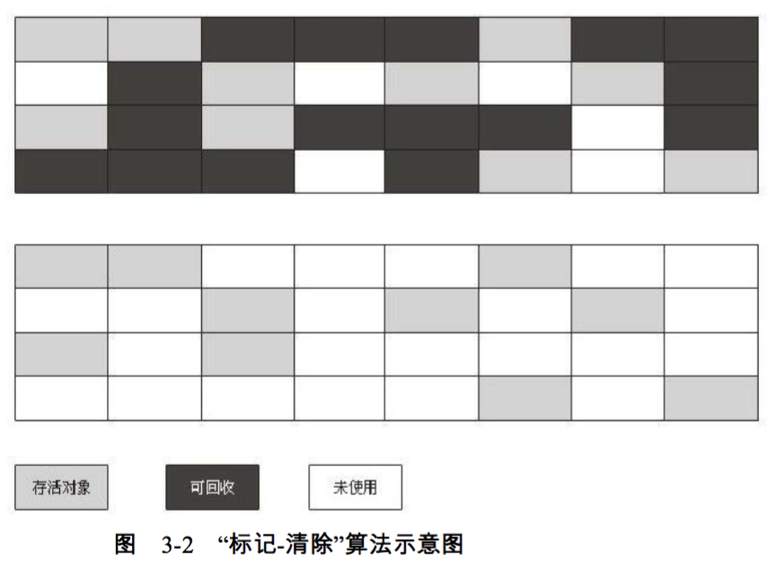
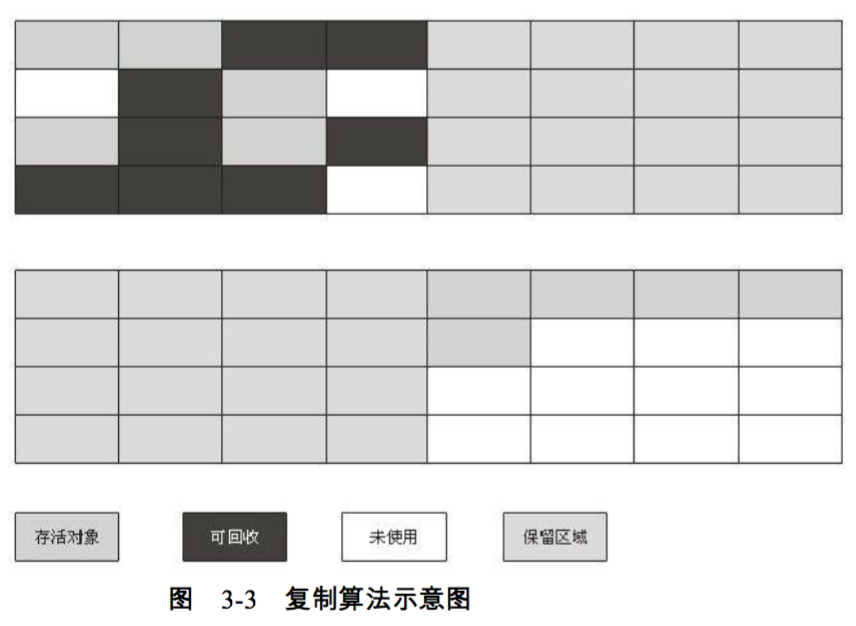
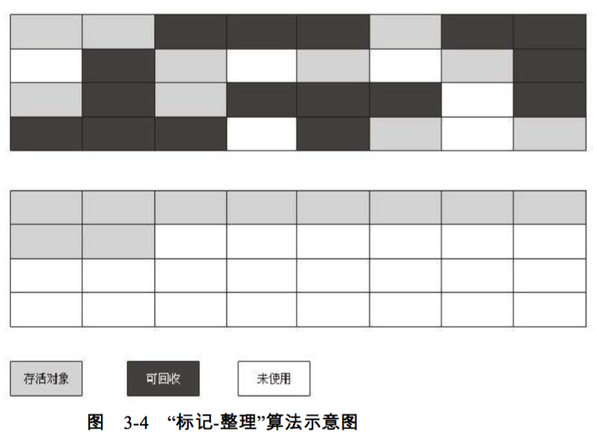
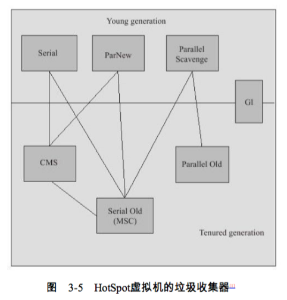
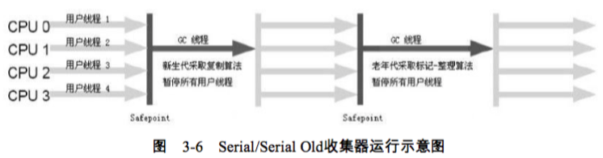
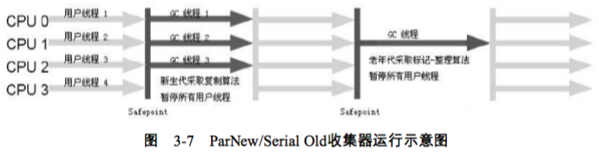
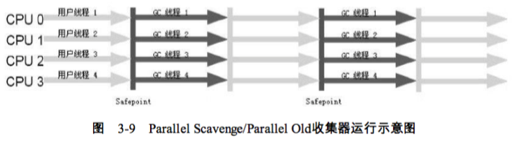
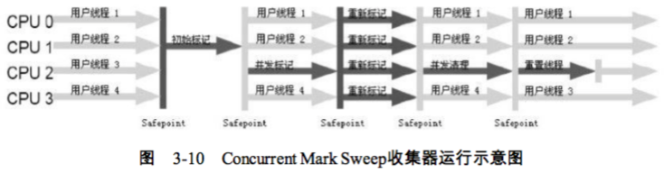
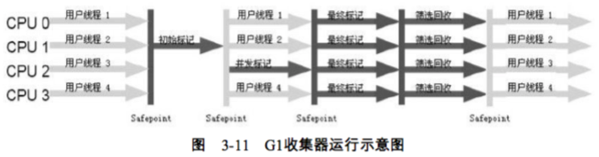
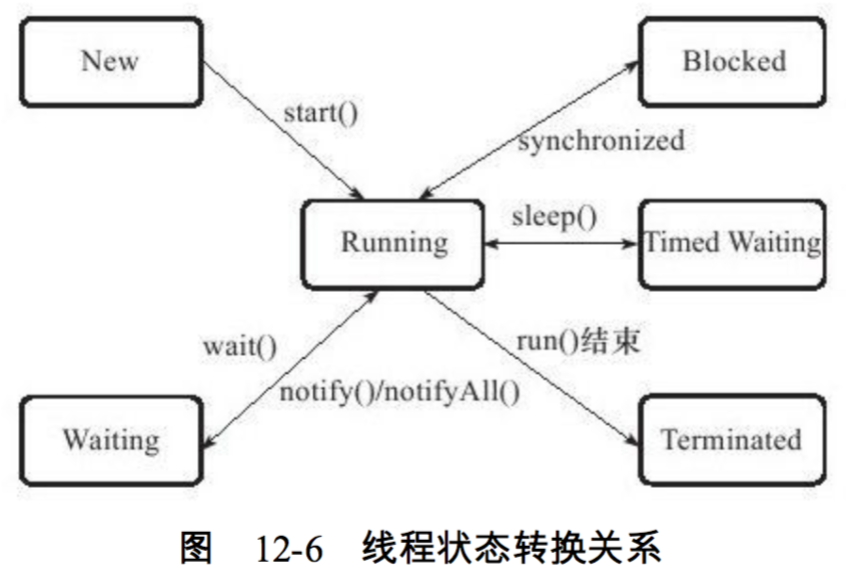

# Java自动内存管理机制 #

* Java内存区域与内存溢出异常
* 垃圾收集器与内存分配策略
* 虚拟机性能监控与故障处理工具

## Java内存区域与内存溢出异常 ##

#### 运行时数据区域 ####

Java虚拟机在执行Java程序的过程中会把它所管理的内存划分为若干个不同的数据区域. 
这些区域都有个字的用途, 以及创建和销毁的时间, 有的区域随着**虚拟机进程**的启动而存在, 有些区域则依赖**用户线程**的启动和结束而建立和销毁.

1. 程序计数器 (线程私有; 无OOM)

    程序计数器 (Program Counter Register) 是一块较小的内存空间, 它可以看作是当前线程所执行的字节码的行号指示器.
    为了线程切换后能恢复到正确的执行位置, 每条线程都需要有一个独立的程序计数器.
    
    > Java方法 vs Native方法
    
2. Java虚拟机栈 (线程私有; StackOverflowError & OutOfMemoryError)

    虚拟机栈 (Java Virtual Machine Stacks) 描述Java方法执行的内存模型: 每个方法在执行的同时都会创建一个栈帧 (Stack Frame) 用于存储局部变量表/操作数栈/动态链接/方法出口等信息.
    每个方法从调用直至执行完成的过程, 就对应着一个栈帧在虚拟机中入栈到出栈的过程.
    
3. 本地方法栈 (线程私有; StackOverflowError & OutOfMemoryError)

    本地方法栈 (Native Method Stack) 与虚拟机栈所发挥的作用是非常相似的, 本地方法栈为虚拟机使用到的Native方法服务.

    > 关于Native方法: ...

4. Java堆  (线程共享; OutOfMemoryError)

    Java堆 (Java Heap) 是被所有线程共享的一块内存区域, 在虚拟机启动的时候创建. 此内存的唯一目的就是存放对象实例, 几乎所有的对象实例都在这里分配.
    Java堆是垃圾收集器管理的主要区域, 因此很多时候也被称作"GC堆".
    
    > Java堆: 从内存回收的角度来看 vs 从内存分配的角度来看

5. 方法区 (线程共享; OutOfMemoryError)

    方法区 (Method Area) 与Java堆一样, 是各个线程共享的内存区域, 它用于存储已被虚拟机加载的类信息/常量/静态变量/即时编译器编译后的代码等数据.
    
    > 方法区是否属于堆?
    > > 虽然Java虚拟机规范把方法区描述为堆的一个逻辑部分, 但是它却有一个别名叫做**Non-Heap (非堆)**, 目的应该是与Java堆区分开来.
    
    > 方法区 vs 永久代
    > > HotSpot虚拟机的设计团队选择把GC分代收集扩展至方法区, 或者说使用永久代来实现方法区, 这样HotSpot的垃圾收集器可以像管理Java堆一样管理这部分内存.
    
6. ~~运行时常量池~~

    运行时常量池是方法区的一部分.
    
    > 注意: 在JDK 1.6及以前的版本中, 由于常量池分配在永久代内, 我们可以通过-XX:PermSize和-XX:MaxPermSize限制方法区大小, 从而间接限制其中常量池的容量.
    
7. ~~直接内存~~

    直接内存 (Direct Memory) 并不是虚拟机运行时数据区的一部分, 它是本机直接分配的内存.
    

#### 实战: OutOfMemoryError异常 ####

1. Java堆溢出 (`HeapOOM.java`)

2. 虚拟机栈和本地方法栈溢出 (`JavaVMStackSOF.java`)

3. 方法区和运行时常量池溢出 (`RuntimeConstantPoolOOM.java`)

4. 本机直接内存溢出 (`DirectMemoryOOM.java`)

## 垃圾收集器与内存分配策略 ##

* 哪些内存需要回收?
* 什么时候回收?
* 如何回收?

#### 判断对象是否可以被GC ####

1. 引用计数算法 -- 当一个对象的引用计数器为0时, 它就是不可能再被使用的
2. 可达性分析算法 -- 当一个对象到GC Roots没有任何引用链相连时, 则证明此对象是不可用的

> 在Java语言中, 可作为GC Roots的对象包括下面几种:

> * 虚拟机栈 (栈帧中的本地变量表) 中引用的对象
> * 方法区中类静态属性引用的对象
> * 方法区中常量引用的对象
> * 本地方法栈中JNI (即一般说的Native方法) 引用的对象

> ~~引用的分类~~:
 
> * 强引用 (Strong Reference)
> * 软引用 (Soft Reference)
> * 弱引用 (Weak Reference)
> * 虚引用 (Phantom Reference)

可达性分析中的"Stop The World"事件: GC进行时**必须停顿所有Java执行线程**, 以保证可达性分析在一个能确保一致性的快照中进行.

#### GC算法 ####

当前商业虚拟机的垃圾收集都采用"分代收集" (Generation Collection) 算法 -- 根据对象存活周期的不同将内存划分为几块. 
一般是把Java堆分为新生代和老年代 (另外还有永久代, 如果把它算在堆范围内的话), 这样就可以根据各个年代的特点采用最合适的收集算法. 

1. 标记-清除算法 (Mark-Sweep)

    
    
    最基本的GC算法
    效率较低; 空间不连续问题

2. 复制算法 (Copying)

    

    新生代通常采用的算法
    98%原则; 预留的survivor内存区; 分配担保
    
    > IBM公司的专门研究表明, 新生代中的对象98%是"朝生夕死"的, 所以并不需要按照1:1(可用空间:预留空间)的比例来划分内存空间, 而是将内存分为一块较大的Eden空间和两个较小的Survivor空间, 每次使用Eden和其中一块Survivor.
    > 当回收时, 将Eden和Survivor中还存活的对象一次性地复制到另外一块Survivor空间上, 最后清理掉Eden和刚才使用过的Survivor空间.
    > 
    > > HotSpot虚拟机默认Eden和Survivor的大小比例是8:1. 

3. 标记-整理算法 (Mark-Compact)

    

    老年代通常采用的算法
    类似"标记-清除"算法, 但对存活的对象进行整理, 维持连续的已用内存和可用内存
    
    > 老年代对象存活率较高, 复制收集算法不适用 (收集时需要进行较多的复制操作 )

---
---

#### 垃圾收集器 ####

如果说收集算法是内存回收的方法论, 那么垃圾收集器就是内存回收的具体实现.

1. Serial (参数: -XX:SurvivorRatio, -XX:PretenureSizeThreshold, -XX:HandlePromotionFailure)

    
    
    复制算法; 单线程新生代回收 (Stop The World)

2. ParNew

    
    
    复制算法; 多线程**并行**新生代回收 (Stop The World)
    
    > 并行 (Parallel) vs 并发 (Concurrent)

3. Parallel Scavenge (参数: -XX:MaxGCPauseMillis -XX:GCTimeRatio) // 外加-XX:+UseAdaptiveSizePolicy, GC自适应的调节策略 (GC Ergonomics)

    

    复制算法; 多线程**并行**新生代回收; 吞吐量优先 (Stop The World)
    
    > 高吞吐量 vs 低停顿

4. Serial Old

    标记-整理算法; 单线程老年代回收; CMS收集器的后备方案

5. Parallel Old 收集器

    标记-整理算法; 多线程**并行**老年代回收; 吞吐量优先; Parallel Scavenge收集器的老年代版本

6. CMS (Concurrent Mark Sweep) (参数: -XX:CMSInitialOccupancyFraction(92%), -XX:+UseCMSCompactAtFullCollection, -XX:CMSFullGCsBeforeCompaction)

    

    标记-清除算法; 多线程**并发**老年代回收; 最短停顿时间优先
    CPU资源敏感; 无法处理浮动垃圾; Concurrent Mode Failure; 空间碎片 ~~(内存整理的过程是无法并发的)~~
    
    > 四阶段收集:
    >
    > * 初始标记 (CMS initial mark)
    > * 并发标记 (CMS concurrent mark)
    > * 重新标记 (CMS remark)
    > * 并发清除 (CMS concurrent sweep)
    >
    > 初始标记仅仅只是标记一下GC Roots能直接关联到的对象, 速度很快; 并发标记阶段就是进行GC Roots Tracing的过程; 重新标记阶段则是为了修正并发标记期间因用户程序继续运作而导致标记产生变动的那一部分对象的标记记录.

7. G1 (Garbage First)

    
    
    并行与并发; 分代收集; 空间整合; **可预测的停顿** (Remembered Set & Remembered Set Logs)

    > 四阶段收集:
    >
    > * 初始标记 (Initial Marking)
    > * 并发标记 (Concurrent Marking)
    > * 重新标记 (Final Marking)
    > * 并发清除 (Live Data Counting and Evacuation)
    >
    > 在G1之前的其他收集器进行收集的范围都是整个新生代或者老年代, 而G1不再是这样. 
    > 使用G1收集器时, Java堆的内存布局就与其他收集器有很大差别, 它将整个Java堆划分为多个大小不等的独立区域(Region), 虽然还保留有新生代和老年代的概念, 但新生代和老年代不再是物理隔离的了, 它们都是一部分Region(不需要联系)的集合.

##### 理解GC日志 #####

    2017-10-23T11:27:26.558+0800: 235464.151: [GC (Allocation Failure) [PSYoungGen: 3306872K->27364K(3394560K)] 9955081K->6675596K(10385408K), 0.0247472 secs] [Times: user=0.00 sys=0.00, real=0.03 secs] 
    2017-10-23T11:27:41.532+0800: 235479.124: [Full GC (Ergonomics) [PSYoungGen: 3317988K->0K(3394560K)] [ParOldGen: 6990840K->826332K(6990848K)] 10308828K->826332K(10385408K), [Metaspace: 87322K->86973K(1130496K)], 3.7522191 secs] [Times: user=0.00 sys=0.00, real=3.75 secs] 

GC发生的时间 GC停顿类型 GC发生的区域 GC前容量 GC后容量 区域总容量 GC前Java堆已使用容量 GC后Java堆已使用容量 Java堆总容量 GC耗时 用户态消耗的CPU时间 内核态消耗的CPU时间 墙钟时间

#### 内存分配与回收策略 ####

1. 对象优先在Eden分配
2. 大对象直接进入老年代
3. 长期存活的对象将进入老年代
4. 动态对象年龄判断
5. 空间分配担保

## 虚拟机性能监控与故障处理工具 ##

#### JDK的命令行工具 ####

**jps**: 虚拟机进程状态工具 (JVM Process Status Tool)

> jps [options] [hostid]
> > -l  输出主类的全名
> > -m  输出虚拟机进程启动时传递给主类的的参数
> > -v  输出虚拟机进程启动时的JVM参数

    jps -mlv

**jstat**: 虚拟机统计信息监视工具 (JVM Statistics Monitoring Tool)

> jstat [option vmid [internal[s|ms]] [count]]
> > -class  监视类装载数量/卸载数量/总空间/类装载所耗费的时间
> > -gc     监视Java堆状况, 包括Eden区/两个Survivor区/老年代/永久代等的容量, 已用空间, GC时间合计等信息
> > -gccapacity  监视内容与 -gc 基本相同, 但输出主要关注Java堆各个区域使用到的最大最小空间
> > -gcutil 监视内容与 -gc 基本相同, 但输出主要关注已使用空间占总空间的百分比
> > -gcnew 
> > -gcold
> > ...

    jstat -gc 19403 1000 60
    jstat -gcutil 19403 1000 60
    jstat -gccapacity 19403 1000

**jinfo**: Java配置信息工具 (Configuration Info for Java)

> jinfo [option] pid
> > 参见jps -v; 参见$CATALINA_BASE/startenv.sh

**jmap**: Java内存映像工具 (Memory Map for Java)

> jmap [option] vmid
> > -dump:[live, ]format=b,file=<filename>  生成Java堆转储快照
> > -heap   显示Java堆详细信息, 如使用哪种回收器/参数配置/分代状况等
> > -histo  显示堆中对象统计信息, 包括类/实例数量/合计容量 ~~(ps: Class.getName())~~
> > -F  当使用正常指令参数没有响应时, 用该选项强制输出结果

    jmap -heap 19403
    jmap -histo 19403
    jmap -dump:format=b,file=Desktop/19403.dump 19403
    
**jhat**: 虚拟机堆转存快照分析工具 (Java Heap Analysis Tool)

**jstack**: Java堆栈跟踪工具 (Stack Trace for Java)

> jstack [option] vmid
> > -l  除堆栈外, 显示关于锁的附加信息
> > -m  如果调用到本地方法的话, 可以显示C/C++的堆栈
> > -F  当使用正常指令参数没有响应时, 用该选项强制输出结果

    jstack 19403
    
> 关于线程状态
> 
> * 新建 (**New**): 创建后尚未启动的线程
> * 运行 (**Runnable**): 该状态包括了操作系统线程状态中的*Running*和*Ready*, 也就是处于此状态的线程有可能正在执行, 也有可能正在等待着CPU为它分配执行时间 (可以理解为线程当前的执行没有受外部依赖的制约?!等待IO算什么情况?!)
> * 无限期等待 (**Waiting**): 处于这种状态的线程不会被分配CPU执行时间, 它们要**等待被其他线程显式地唤醒**
> > - 没有设置Timeout参数的`Object.wait()`方法
> > - 没有设置Timeout参数的`Thread.join()`方法
> > - `LockSupport.park()`方法 
    
> * 限期等待 (**Timed Waiting**): 处于这种状态的线程不会被分配CPU执行时间, 但无须等待被其他线程显式地唤醒, 在**一定时间后它们会由系统自动唤醒**
> > - `Thread.sleep()`方法
> > - 设置了Timeout参数的`Object.wait()`方法
> > - 设置了Timeout参数的`Thread.join()`方法
> > - `LockSupport.parkNanos()`方法
> > - `LockSupport.parkUntil()`方法

> * 阻塞 (**Blocked**): 线程被阻塞了. 在等程序等待进入同步区域的时候, 线程将进入这种状态. "阻塞状态"与"等待状态"的区别是 -- "阻塞状态"在**等待着获取到一个排他锁**, 这个事件将在另外一个线程放弃这个锁的时候发生; 而"等待状态"则是在等待一段时间或者唤醒动作的发生.  
> * 结束 (**Terminated**): 已终止线程的状态, 表明线程已经结束执行.

#### JDK的可视化工具 ####

JConsole: jconsole &
VisualVM:`jvisualvm &

    // 不要求权限
    -Dcom.sun.management.jmxremote.port=8999 -Dcom.sun.management.jmxremote.ssl=false -Dcom.sun.management.jmxremote.authenticate=false

> 如果要求jmx远程访问权限, 对应的jmx权限配置过程如下:
> 
> 1. 复制jdk提供的jmx帐号和密码配置文件模板到tomcat实例的conf目录: `cp $JAVA_HOME/jre/lib/management/jmxremote.* ${CATALINA_BASE}/conf && chown tomcat:tomcat ${CATALINA_BASE}/conf/jmxremote.*`
> 2. 重命名: `mv jmxremote.password.template jmxremote.password`
> 3. 给密码文件加上写权限 (原文件是只读的): `chmod +w jmxremote.password`    
> 4. 以追加方式往jmxremote.access文件中加入一个只读权限的帐号: `echo "${jmxuser}   readonly" >> jmxremote.access`
> 5. 以追加方式往jmxremote.password文件中加入上面配置过的账号和对应的密码: `echo "${jmxuser}   ${password}" >> jmxremote.password`
> 6. 修改jmxremote.*的权限，只允许tomcat对该文件拥有读写权限: `chmod 600 jmxremote.*` 
> 7. 往JVM启动参数中追加jmx相关配置参数: 
>       
>         -Dcom.sun.management.jmxremote.port=8999 -Dcom.sun.management.jmxremote.authenticate=true -Dcom.sun.management.jmxremote.ssl=false 
>         -Dcom.sun.management.jmxremote.password.file=$CATALINA_BASE/conf/jmxremote.password -Dcom.sun.management.jmxremote.access.file=$CATALINA_BASE/conf/jmxremote.access`

--- 
--- 

**JVM参数解析**

-XX:+DisableExplicitGC
-XX:+PrintGCDateStamps -XX:+PrintGCDetails -Xloggc:$CATALINA_BASE/logs/gc.log -XX:+HeapDumpOnOutOfMemoryError -XX:HeapDumpPath=$CATALINA_BASE/cache

_...
-XX:+UseSerialGC (Serial + Serial Old)
-XX:+UseParNewGC (ParNew + Serial Old)
-XX:+UseConcMarkSweepGC (ParNew + CMS + Serial Old)
-XX:+UseParallelGC (Parallel Scavenge + Serial Old)
-XX:+UseParallelOldGC (Parallel Scavenge + Parallel Old)
..._

> 分享一个口袋利器: JVMPocket (一个用于参考和交流JVM参数的微信小程序)

**解决问题的一般思路和步骤**

top ps gc日志
jps jstat jmap jstack

**代码上的考虑: 内存友好的数据存取方式 & 适当的并发**

0: 流式存取
1: 分页/分批, 注意实现数据分页读取时的page大小
2: 并发

**FAQ**

* 如何查看当前JVM进程使用的垃圾收集器 (垃圾收集器组合)

        jmap -heap ${PID}

* 如何定位问题代码

    > 1) 找到CPU利用率持续比较高的进程: `top`
    > 2) 找到上述进程中，CPU利用率比较高的线程号TID: `ps p ${PID} -L -o pcpu,pid,tid,time,tname,cmd`
    > 3) 将获取的线程号(十进制数)转换成十六进制: `printf "%x\n" ${TID}`
    > 4) 从jstack输出结果中查找对应线程以及代码: `jstack -l ${PID} | grep -100 ${TID_IN_HEX}`

* 操作系统线程状态 vs JVM线程状态
* 虚拟机参数的各种设定方式

    http://blog.csdn.net/chenleixing/article/details/43230527

* 如何在命令行运行java类并指定JVM参数

    cd ${类路径根目录}
    java ${参数列表} ${类的全限定名}

* Metaspace是啥

    JAVA 8 ：从永久区（PermGen）到元空间（Metaspace）
    http://caoyaojun1988-163-com.iteye.com/blog/1969853
