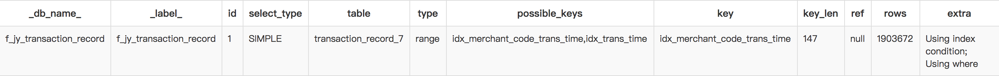
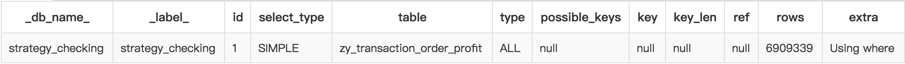
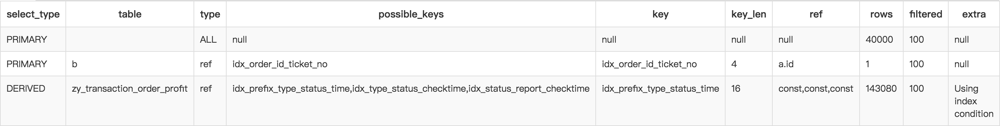

# MySQL查询优化 # 

> 查看表状态:
> SHOW TABLE STATUS LIKE "表名"

## 查询优化方案 ## 
1) SCHEMA与数据类型优化

只分配真正需要的空间: 

    VARCHAR vs CHAR
    TIMESTAMP vs DATETIME

范式和反范式:

    -- 范式
    SELECT message_text, user_name
    FROM message INNER JOIN user ON message.user_id = user.id
    WHERE user.account_type = 'VIP'
    ODER BY message.published DESC
    LIMIT 10;
    
    -- 反范式
    SELECT message_text, user_name
    FROM user_messages
    WHERE account_type = 'VIP'
    ORDER BY published DESC
    LIMIT 10;
    
混用范式化和反范式化: 缓存表 & 汇总表

2) 索引优化

* 索引类型:
> 按索引底层结构/实现方式划分: B-Tree索引, 哈希索引, 空间数据索引(R-Tree), 全文索引, ...
> 按索引对数据的组织形式划分: 单列索引, 联合索引, 唯一索引, 聚簇索引, ...

* 关于B-Tree索引: 
> 最常见的B-Tree索引, 按照顺序存储数据, 所以MySQL可以用来做ORDER BY和GROUP BY操作. 
> 因为数据是有序的, 所以B-Tree也就会将相关的值都存储在一起. 
> 最后, 因为索引中存储了实际的列值, 所以某些查询只使用索引就能够完成全部查询.
> > 1. 索引大大减少了服务器需要扫描的数据量
> > 2. 索引可以帮助服务器避免排序和临时表
> > 3. 索引可以将随机I/O变为顺序I/O

> 索引评估之"三星系统": 索引将相关的记录放到一起则获得一星; 如果索引中的数据顺序和查找中的排序顺序一致则获得二星; 如果索引中的列包含了查询中需要的全部列则获得三星.

* 高性能的索引策略:
> * 单列索引
> > 思考: 如何选择合适的索引列?
>
> * 前缀索引和索引选择性  count(distinct prefix)/count(*)
>
> * 多列索引  vs: 索引合并(v5.0)
> > 思考: 如何选择合适的索引列顺序?
    
    -- 使用关联索引
    select *
    from bx_insurance_order
    where check_type = 1 and check_status = 2 and pay_time >= '2017-07-01' and pay_time < '2017-07-02'
    
    -- 使用索引合并
    select *
    from bx_insurance_order
    where (pay_time >= '2017-07-01' and pay_time < '2017-07-02') or (check_date >= '2017-07-01' and check_date < '2017-07-02')

> > 当不考虑排序和分组时, 将选择性最高的列放在前面通常是很好的选择; 然而, 选择性绝不是唯一准则.
>
> * (*)聚簇索引  vs: 二级索引 
> > 聚簇索引实际上不是一种单独的索引类型, 而是一种数据存储方式. 术语"聚簇"表示数据行和相邻的键值紧凑地存储在一起. 相比二级索引, 主键聚簇索引只是二级索引中的"一级".
>
> * (*)覆盖索引
> > 如果一个索引包含所有需要查询的字段, 我们就称之为覆盖索引.
>
> * (*)使用索引扫描来做排序

* 索引案例: 参见后面case

3) 查询优化

* 慢查询基础: 优化数据访问
> 1. 是否向数据库请求了不必要的数据
> 2. 是否扫描了额外的记录 (返回的行数 vs 扫描的行数)

* 查询重构
> 1. 一个复杂查询还是多个简单查询 (QPS vs 吞吐量)
> 2. 切分查询 (分批处理)
> 3. 分解关联查询 (分布, 模拟关联)

## EXPLAIN概览 ##

要使用EXPLAIN, 只需要在查询中的SELECT关键字之前增加EXPLAIN关键字. MySQL会在查询上设置一个标记. 当执行查询时, 这个标记会使其返回关于在执行计划中每一步的信息, 而不是执行它.
查询中的每个表在EXPLAIN的输出中只有一行. "表"的意义在这里相当广: 可以是一个子查询, 一个UNION结果等.
注意, 输出中的行以MySQL实际执行的查询部分的顺序出现, 而这个顺序不总是与其在原始SQL中的顺序相一致.

cf: EXPLAIN EXTENDED && SHOW WARNINGS 

* id列

* select_type列
> MySQL将SELECT查询分为简单(SIMPLE)和复杂类型, 复杂类型可分为三大类: 简单子查询(SUBQUERY), 所谓的派生表(DERIVED), 以及UNION查询(UNION).
> SIMPLE值意味着查询不包括子查询和UNION. 
> 如果查询有任何复杂的子部分, 则最外层部分标记为PRIMARY, 其他部分标记为SUBQUERY/DERIVED/UNION/UNION RESULT.

* table列
> 这一列显示了对应行正在访问那个表.
cf: &lt;derivedN>和&lt;unionA, B>

* type列
> 这一列显示了"关联类型"(所有的查询都是关联), 或者说"访问类型", 也就是MySQL决定如何查找表中的行.
> 最重要的访问方法列举, 查询效果从最差到最优:
> **ALL** 全表扫描(顺序IO)
> **index** 索引扫描(同全表扫描, 但是按照索引顺序扫描表, 随机IO)
> **range** 范围扫描(有限制的索引扫描)
> **ref** 索引访问
> **eq_ref** 唯一性索引访问
> **const**, system 常量
> **NULL** 意味着MySQL能在优化阶段分解查询语句, 在执行阶段甚至用不着再访问表或者索引

* possible_keys列
> 这一列显示了查询可以使用哪些索引

* key列
> 实际使用的索引

* key_len列
> 索引长度

* ref列
> 参考的列

* rows列
> 扫描行数

* extra列
> Using index(服务器层); Using where(存储引擎层); Using temporary(临时表); Using filesort(外部索引排序); ...

## 案例分析 ##

来源: http://dubai.corp.qunar.com:3438/slow_list.html?type=mysql
说明: dubai平台上有各数据库MySQL慢查询统计信息和详情, 包含慢查询语句/执行时间/执行次数/表结构等信息

1) 查询PPM资金(f_pifa1, f_jy_transaction_record, transaction_record_*)

> 查询语句: 

    -- 标准sql, 总时间6828.6s, 平均时间1.91s, 执行次数3572
    SELECT *
    FROM transaction_record_?
    WHERE trans_time >= '?' AND trans_time < '?' AND merchant_code = '?' AND accounting_type = '?'
    LIMIT ?;

    -- 样本sql, 执行时间1.63s
    SELECT *
    FROM transaction_record_7
    WHERE trans_time >= '2017-07-19 00:00:00' AND trans_time < '2017-07-20 00:00:00' AND merchant_code = 'newttsqnf' AND accounting_type = 'DAIKOUOUT'
    LIMIT 100 OFFSET 100000;

> Explain结果:
> 
>
> 问题描述:
> 偏移量较大(100000) && 分页过小(100)
> 原有索引`idx_merchant_code_trans_time`(`merchant_code`,`trans_time`)针对这一查询并不是最优的
>
> 解决方案: 
> 降低偏移量, 分解单组查询条件的查询范围 (绝对偏移 vs 相对偏移); 适当增加分页大小, 减少查询次数 (吞吐量 vs QPS)
> 添加更符合查询场景的索引`idx_code_type_time` (`merchant_code`,`accounting_type`,`trans_time`)

    -- 一个可能的优化后的结果
    SELECT *
    FROM transaction_record_7
    WHERE trans_time >= '2017-07-19 23:00:00' AND trans_time < '2017-07-20 00:00:00' AND merchant_code = 'newttsqnf' AND accounting_type = 'DAIKOUOUT'
    LIMIT 500 OFFSET 1000;

2) 查询自营对账已核实订单

> 查询语句: 

    -- 标准sql, 总时间37.1s, 平均时间37.1s, 执行次数1
    select *
    from zy_transaction_order_profit
    where 1 = 1 and check_time >= '2017-07-19 00:00:00' and check_time < '2017-07-20 16:00:13';
    
    -- 样本sql, 执行时间37.1s
    select *
    from zy_transaction_order_profit
    where 1 = 1 and check_time >= '2017-07-19 00:00:00' and check_time < '2017-07-20 16:00:13';

> Explain结果: 
> 
>
> 问题描述:
> 没有合适的索引, 或者说, 查询没有充分利用到已有的索引
> 原有索引`idx_type_status_checktime` (`record_type`,`record_status`,`check_time`)
> 
> 解决方案: 
> 新建check_time单列索引, 或者基于原有联合索引改写sql

    -- 一个可能的优化后的结果
    select *
    from zy_transaction_order_profit
    where 1=1 and record_type in (1, 2, 3) and record_status in (1, 2) and check_time>='2017-07-19 00:00:00' and check_time<'2017-07-20 16:00:13'
    
3) 关联查询自营对账订单和票

> 查询语句: 

    -- 标准sql
    SELECT
      a.*,
      b.*
    FROM zy_ticket_bill b INNER JOIN
      (
        SELECT *
        FROM zy_transaction_order_profit
        WHERE record_type = ? AND record_status = ? AND agent_prefix = ?
        LIMIT ?
      ) a ON b.order_id = a.id
      
    -- 样本sql
    SELECT
      a.*,
      b.*
    FROM zy_ticket_bill b INNER JOIN
      (
        SELECT *
        FROM zy_transaction_order_profit
        WHERE record_type = 2 AND record_status = 1 AND agent_prefix = 'xep'
        LIMIT 30000, 10000
      ) a ON b.order_id = a.id;

> Explain结果: 
> 
>
> 问题描述:
> 分页偏移量较大, 没能利用覆盖索引, 回表扫描数据量较多
> 原有索引`idx_prefix_type_status_time` (`agent_prefix`,`record_type`,`record_status`,`trans_time`)
> 
> 解决方案: 
> 充分利用原有索引进行索引覆盖, 使用"延迟关联"的技巧

    -- 一个可能的优化后的结果
    SELECT
      a.*,
      b.*
    FROM zy_ticket_bill b
    INNER JOIN (
        zy_transaction_order_profit a
		INNER JOIN (
		  	SELECT id
        	FROM zy_transaction_order_profit
        	WHERE record_type = 2 AND record_status = 1 AND agent_prefix = 'xep'
        	LIMIT 30000, 10000
    	) id_tmp using(id)
    ) ON b.order_id = a.id;